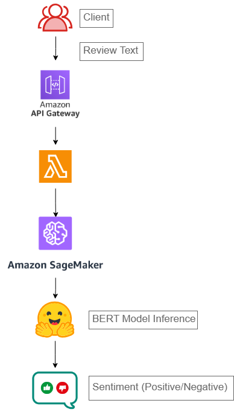

# 📦 Amazon-Style Sentiment Classifier  
**Scalable NLP Pipeline Using BERT, SageMaker, and Lambda**

---

## 🧠 Project Objective

This project replicates a real-world sentiment analysis pipeline like the ones used by Amazon to classify customer product reviews. It fine-tunes a BERT-based model on the IMDB dataset and deploys the model on **AWS SageMaker**, making it accessible via a **REST API** through **Lambda** and **API Gateway**.

The goal is to build an **end-to-end, production-ready machine learning system** using modern NLP and cloud tools.

---

## 📈 Key Features

- ✅ Clean and tokenize large-scale review data  
- ✅ Fine-tune `DistilBERT` for sentiment classification  
- ✅ Deploy model on AWS SageMaker as an inference endpoint  
- ✅ Integrate Lambda + API Gateway to expose a public API  
- ✅ Real-time prediction of review sentiment (Positive/Negative)

---

## 🧱 Architecture Overview

---

## 🛠️ Tech Stack

| Tool           | Purpose                          |
|----------------|----------------------------------|
| 🤗 HuggingFace | Tokenization + BERT fine-tuning |
| 🧠 PyTorch     | Model training                  |
| 📦 SageMaker   | Model hosting & inference       |
| ⚙️ Lambda      | Lightweight backend              |
| 🌐 API Gateway | Expose REST API endpoint        |
| 🐍 Python      | Glue for entire pipeline         |

## 🧪 Dataset

**IMDB Movie Reviews Dataset**  
- 50,000 reviews labeled as *positive* or *negative*  
- Used for training and testing the classifier  
- Source: [HuggingFace Datasets](https://huggingface.co/datasets/imdb)

---

## 🚀 Sample Input/Output

**Request:**
```json
POST /predict
{
  "text": "This is the best purchase I've made in years!"
}
